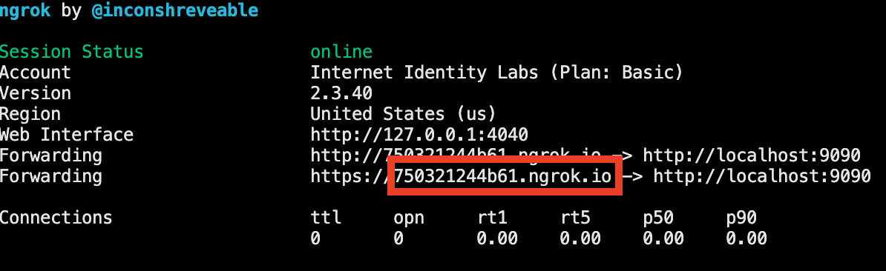

# NFID Auth-Client Demo

This is an example project, intended to demonstrate how an app developer might integrate with [NFID](https://nfid.one).

For a typescript implementation, see https://github.com/internet-identity-labs/nfid-auth-client-demo/tree/feature/nfid-auth-client-demo

[Live demo](https://hvn26-aiaaa-aaaak-aaa2a-cai.ic0.app/)

This is an example showing how to use [@dfinity/auth-client](https://www.npmjs.com/package/@dfinity/auth-client).

To get started, you might want to explore the project directory structure and the default configuration file. Working with this project in your development environment will not affect any production deployment or identity tokens.

To learn more before you start working with auth_demo, see the following documentation available online:

- [Quick Start](https://sdk.dfinity.org/docs/quickstart/quickstart-intro.html)
- [SDK Developer Tools](https://sdk.dfinity.org/docs/developers-guide/sdk-guide.html)
- [Motoko Programming Language Guide](https://sdk.dfinity.org/docs/language-guide/motoko.html)
- [Motoko Language Quick Reference](https://sdk.dfinity.org/docs/language-guide/language-manual.html)

## Setting up for local development

To get started, start a local dfx development environment in this directory with the following steps:

```bash
cd nfid-auth-client-demo/
yarn
dfx start --background --clean
dfx deploy
```

Make sure to update the name of your application so it displays to the user during authentication
```js
// line 19 in src/auth_client_demo_assets/src/index.js
const APPLICATION_NAME = "Your%20Application%20Name";
```

### To make authenticated calls on your local replica

To make authenticated calls on your local replica, you will need the [NFID-SDK](https://github.com/internet-identity-labs/NFID-SDK) repo cloned locally, adjacent to this project. 

```bash
cd ../nfid-sdk
DFX_VERSION=0.9.3 sh -ci "$(curl -fsSL https://sdk.dfinity.org/install.sh)"
yarn
rm -rf .dfx/local
cd examples/create-ic-app-react-demo
rm -rf .dfx/local
yarn deploy:local
yarn serve:nfid-frontend
```

Next, [download](https://ngrok.com/download) the ngrok zip file for your machine and unpack the binary to `NFID-SDK/examples/create-ic-app-react-demo/scripts`, then run `yarn tunnel` from within that directory.
```bash
# in a new terminal window, cd to scripts directory where you've unpacked the ngrok binary
cd scripts
yarn tunnel
```
Paste the assigned domain from ngrok output to the `LOCAL_NGROK_TUNNEL_DOMAIN` variable on line `9` of `webpack.config.js`


Finally, cd back into the `nfid-auth-client-demo` and run `npm start`
```bash
cd ../../../../nfid-auth-client-demo
npm start
```

You can now access the app at `http://localhost:8080`.
